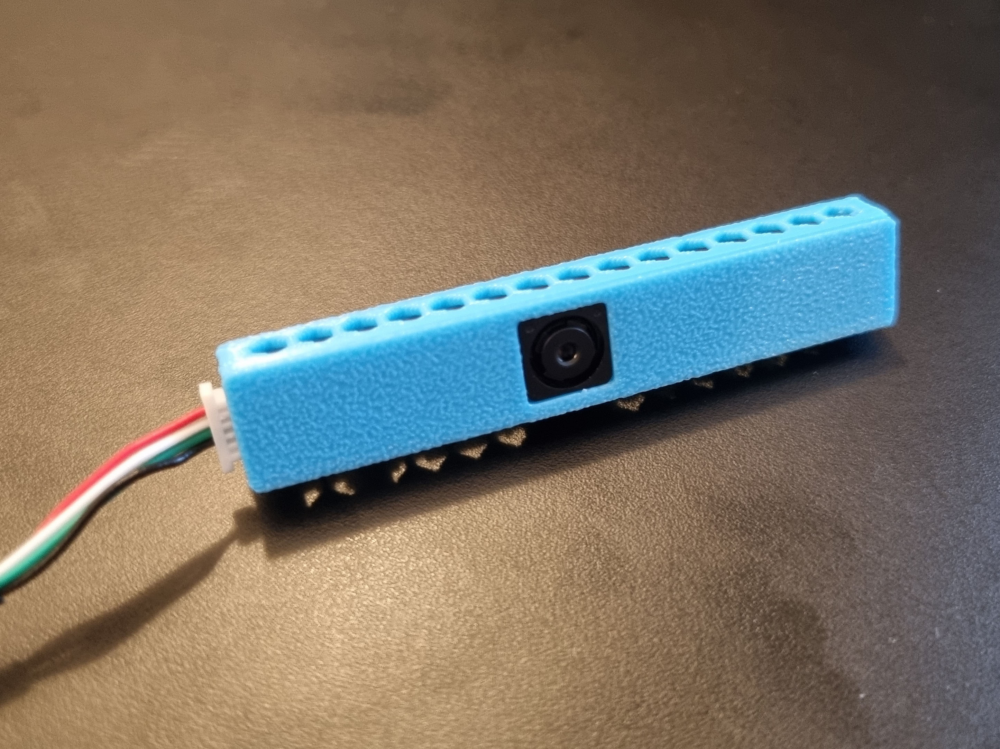
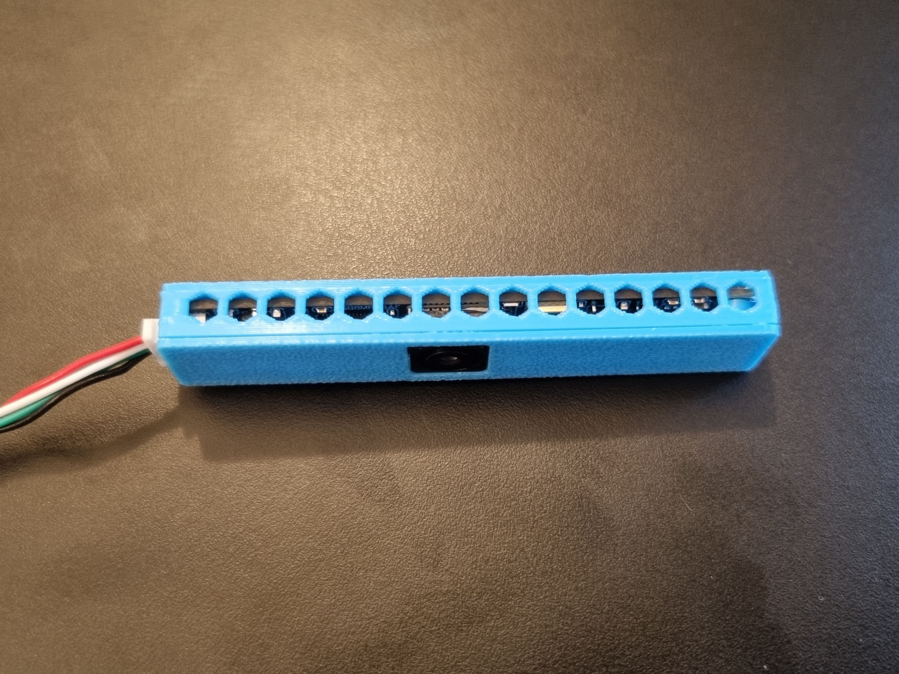
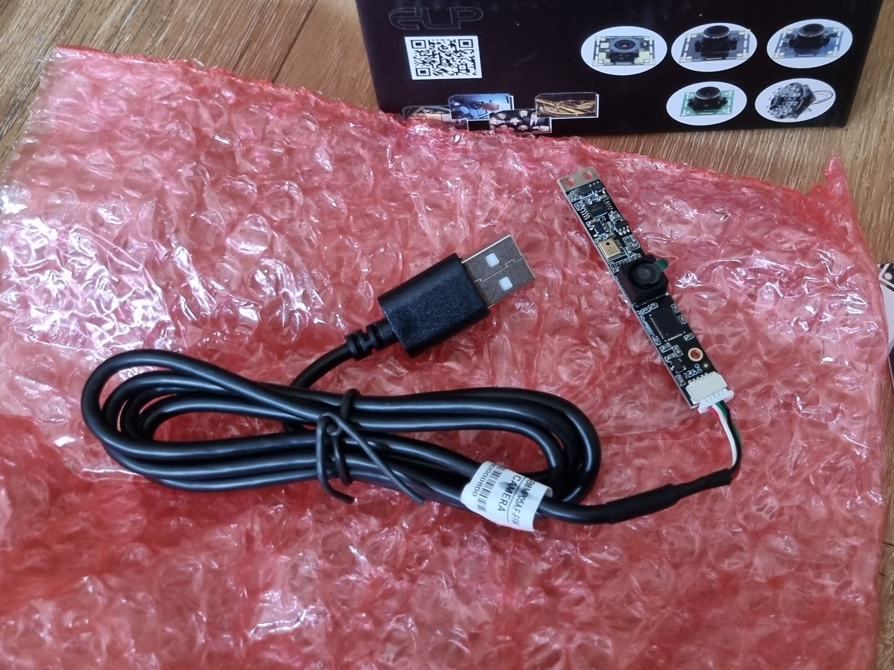

# ELP DIY camera module board 62x9.1 mm

A really compact case to protect the camera from dust and mechanical damage.

## Variants and parts

**Bottom**:

- [diy_62x9_bottom_vent.stl](diy_62x9_bottom_vent.stl) - bottom part with ventilation holes
- [diy_62x9_bottom_novent.stl](diy_62x9_bottom_novent.stl) - bottom part without ventilation holes

**Top**:

- [diy_62x9_top_mic.stl](diy_62x9_top_mic.stl) - top part with microphone hole
- [diy_62x9_top_nomic.stl](diy_62x9_top_nomic.stl) - top part without microphone hole

## Printing

The geometry of the model is adjusted to be easy to print. The ventilation holes are designed to use no bridging and no supports.

Prints well with:

- 0.2 mm / 0.2 mm layer height
- 150 mm/s
- no supports, no rafts, no brims

Printed on:

- [Anycubic Kobra 2 Pro](https://amzn.to/4e0Dz7R)

Printed with:

- [Giantarm HS-PLA](https://amzn.to/3B8snY7)

## Compatible cameras

### Works with

- [ELP 8MP USB 2.0 64 degrees lens / CMOS IMX179](https://amzn.to/3MONvFr)
- [Svpro 8MP / SV-USB8MP05AF-FF64](https://amzn.to/3ZrJC0C)

### Might work with

- Other ELP and different brand cameras with similar form factor (some require a mirror flip for the mounting holes)

## Images

