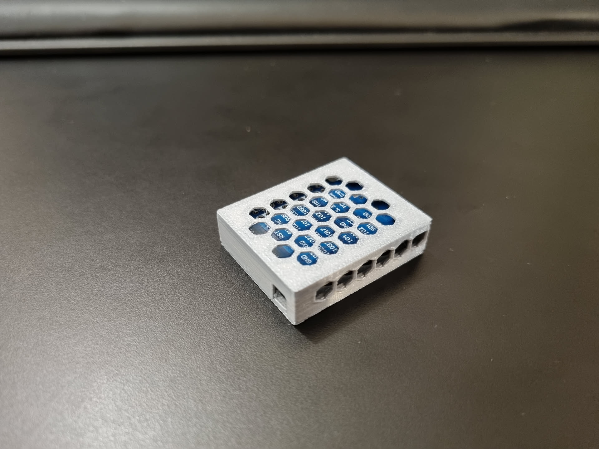

# ESP32 small case for WLED project

The model is made to accommodate the ESP32 board (up to 40x32 mm) with a single USB connector and cables to control an LED strip. The case has ventilation holed from all sides to ensure proper cooling of the board and any possible mounting positions to fix the board in place while not blocking the air fully.

Short presentation of this project on YouTube

_Click the image below to watch a short presentation of this project on YouTube:_

## Printing

Prints well with:

- 0.2 mm / 0.2 mm layer height
- 150 mm/s
- no supports, no rafts, no brims

Printed on:

- [Anycubic Kobra 2 Pro](https://amzn.to/4e0Dz7R)

Printed with:

- [GEEETECH HS-PLA](https://amzn.to/4iHYdfM)

## Compatible boards

If not sure, measure the size of the board. The model is made to hold the ESP32 without touching bottom and top plates of the case, using small "legs" in all 4 corners. The board is fixed in place by the geometry of the two parts.

### Works with

- [AZDelivery 1 x ESP32 D1 Mini NodeMCU, USB-C](https://amzn.to/4gBhuxq)
- [AZDelivery 3 x ESP32 D1 Mini NodeMCU, USB-C](https://amzn.to/4fm36rJ)
- [AZDelivery 5 x ESP32 D1 Mini NodeMCU, USB-C](https://amzn.to/49IrO4D)

### Might work with

- Other ESP32 boards with similar form factor. Check the size of the board and the position of the USB connector.

## Images

