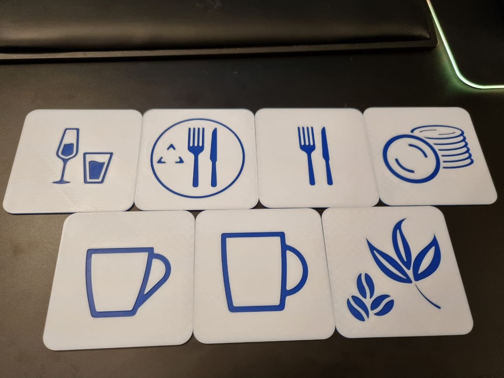

# Square Engraved Icons (100 x 100 mm)

The models of engraved icons are to be single-colour / two-colour printed for general purposes.

Short presentation of this project on YouTube

_Click the image below to watch a short presentation of this project on YouTube:_

## Printing

Prints well with:

- 0.2 mm / 0.2 mm layer height
- 150 mm/s
- no supports, no rafts, no brims

**For two-colour printing** switch filament after the first 1 mm of the print (e.g. between layers 5 and 6 when 0.2 mm layer height is used).

Printed on:

- [Anycubic Kobra 2 Pro](https://amzn.to/4e0Dz7R)

Printed with:

- [TECBEARS PLA+](https://amzn.to/40R79Zk)
- [DEEPLEE PLA+](https://amzn.to/40QmTeW)

## Images

